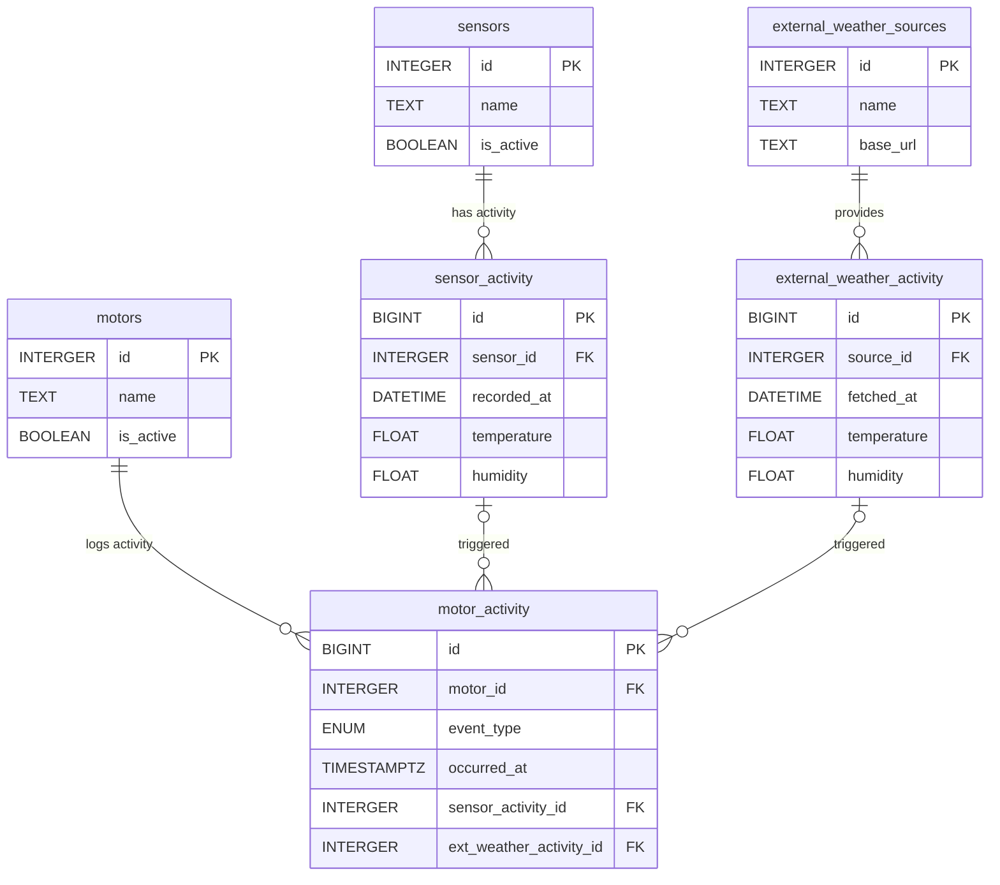

```mermaid
erDiagram
    sensors {
        INTEGER id PK
        TEXT name
        BOOLEAN is_active
    }

    sensor_activity {
        BIGINT id PK
        INTERGER sensor_id FK
        DATETIME recorded_at
        FLOAT temperature
        FLOAT humidity
    }

    external_weather_sources {
        INTERGER id PK
        TEXT name
        TEXT base_url
    }

    external_weather_activity {
        BIGINT id PK
        INTERGER source_id FK
        DATETIME fetched_at
        FLOAT temperature
        FLOAT humidity
    }

    motors {
        INTERGER id PK
        TEXT name
        BOOLEAN is_active
    }

    motor_activity {
        BIGINT id PK
        INTERGER motor_id FK
        ENUM event_type
        TIMESTAMPTZ occurred_at
        INTERGER sensor_activity_id FK
        INTERGER ext_weather_activity_id FK
    }

    sensors ||--o{ sensor_activity : "has activity"
    external_weather_sources ||--o{ external_weather_activity : "provides"
    motors ||--o{ motor_activity : "logs activity"
    sensor_activity |o--o{ motor_activity : "triggered"
    external_weather_activity |o--o{ motor_activity : "triggered"
```